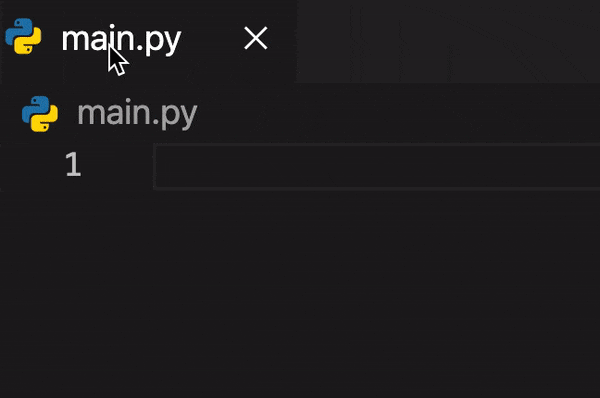

# **PyColonize**

## Features

- Adds three shotcuts to insert colons with ease if required for python keyword at the beginning of the line;

  - <kbd>shift</kbd> + <kbd>enter</kbd> Insert colon at the end of line and continue on the same line
  - <kbd>ctrl</kbd> + <kbd>enter</kbd> Insert colon at the end of line and continue on the new line
  - <kbd>ctrl</kbd> + <kbd>alt</kbd> + <kbd>enter</kbd> Insert colon and stay at the same position

- First accepts autocomplete suggestion if one is present and then does its job

> Note: If line contains colon cursor will still move

## Links
* [GitHub](https://github.com/vmsynkov/colonize)
* [VisualStudio Marketplace](https://marketplace.visualstudio.com/items?itemName=vmsynkov.colonize)
